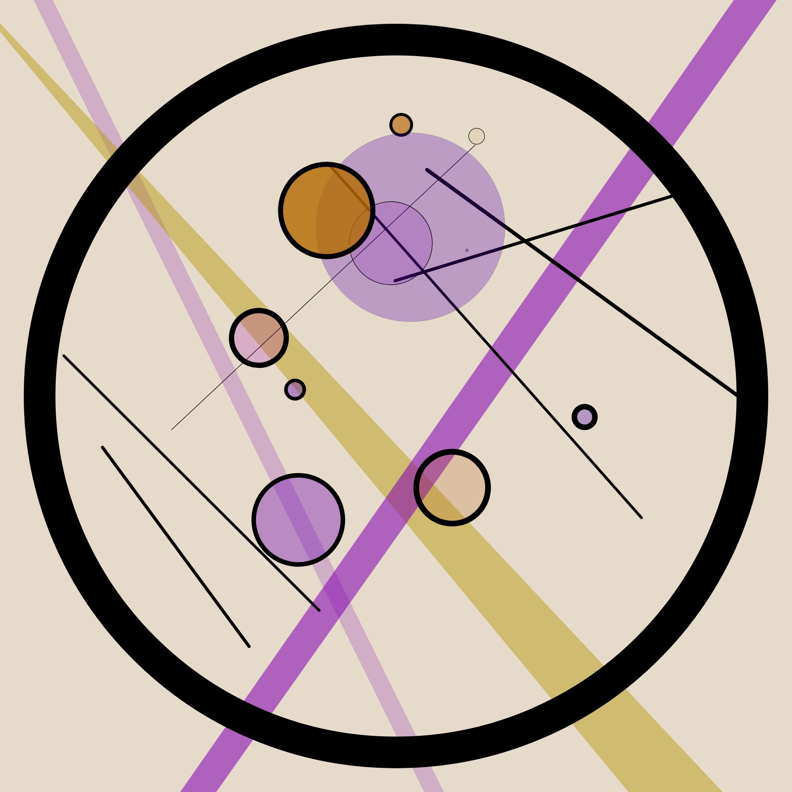
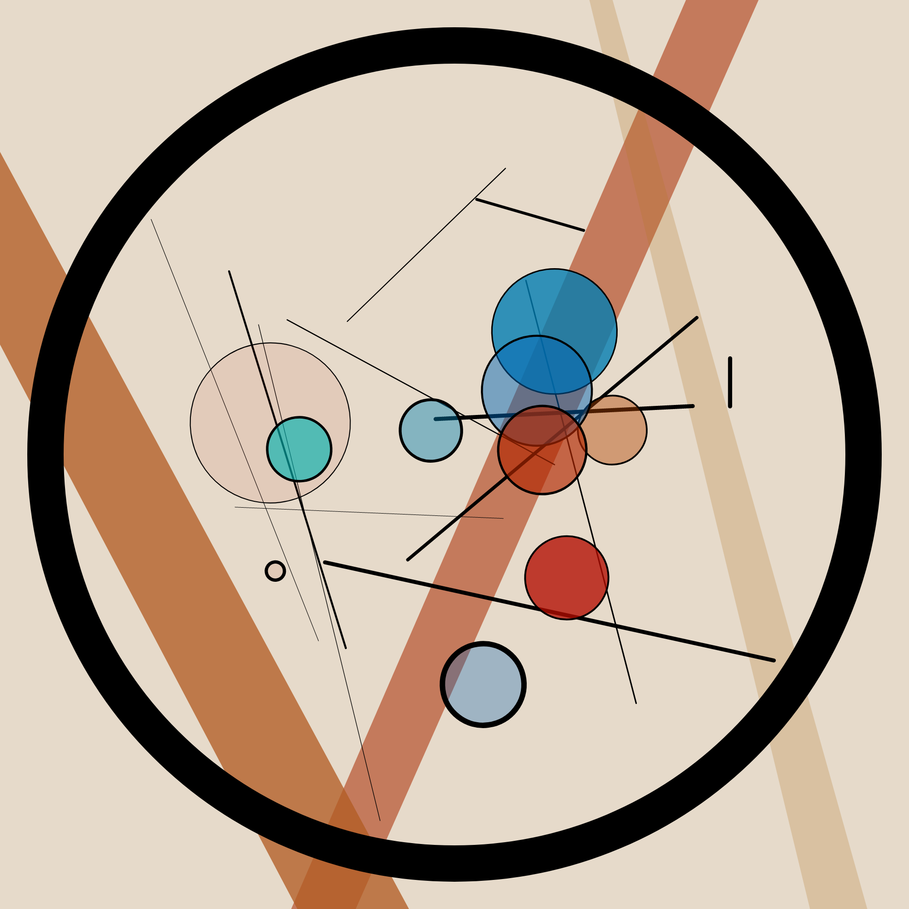
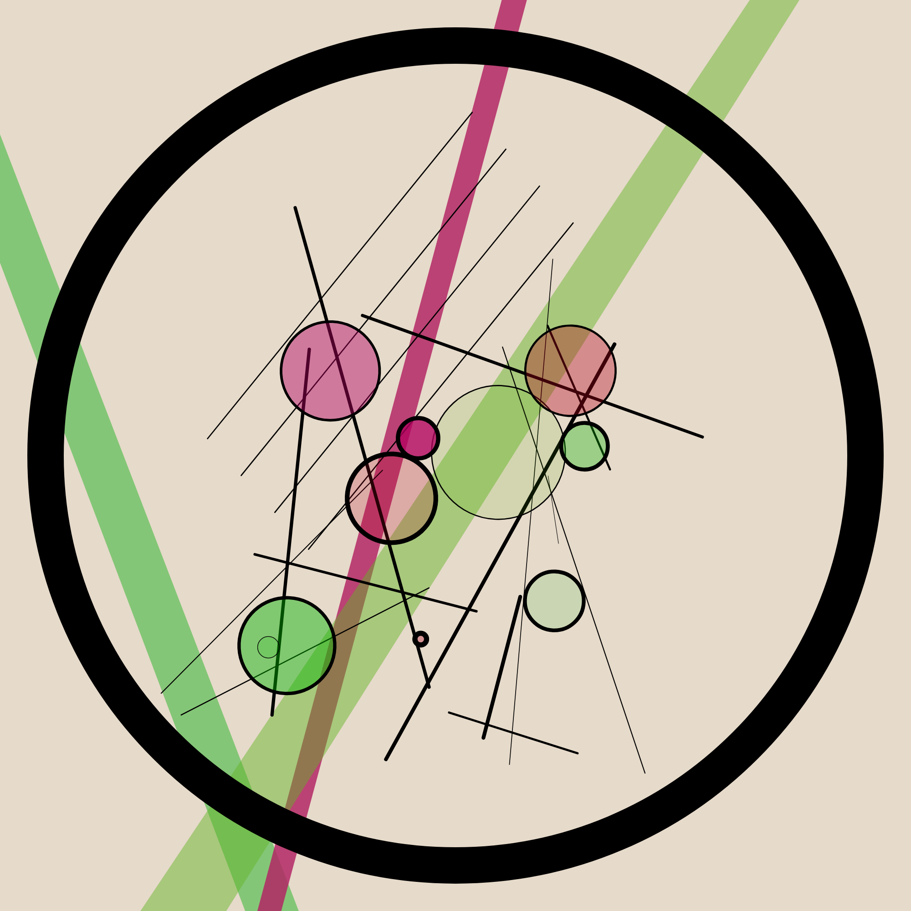

# Deconstructing Master Artists (DMA):   Wassily Kandinsky - Kreise im Kreis (1923)

## About Kandinsky
Wassily Kandinsky (16 December 1866 - 13 December 1944) was a Russian painter and art theorist and is generally considered to be one of the pioneers of Abstract Art. In 1896 he started studying in Munich. With the outbreak of the First World War he returned to his home country of Russia. After the Russian Revolution he helped to establish the Institue of Artistic Culture and the Museum of the Culture of Painting in Moscow. But his artistic expression was soon rejected as too individualistic and bourgeois. In 1920 he returned to Germany due to an invitation by Walter Gropius and went on to teach at the Bauhaus school of art and architecture from 1922 to 1933 when it was closed by the Nazis. He spent the rest of his life creating in an apartment in Paris.

## Style
Kandinsky was inspired early on by works of Monet. He felt that the colours were almost detached from what the paintings depicted. This became a pillar of his own creations: expressing himself through colour and not by objective truths. Kandinsky's early work shows a definite influence from Pointilism and Fauvism. As an art theorist he was inspired by music as it is inherently abstract. In the 1920s and the beginning of his period teaching at the Bauhaus school his formerly very dynamic style merged into geometric compositions. His later post-Bauhaus style was a mix of both his prior phases: combining his free flowing color depictions and his geometric abstractions while maintaing vivid color harmonies.

## Kreise im Kreis (1923) - Circle in a Circle
.jpg)
[Image Source](https://www.wassilykandinsky.net/work-247.php)

Kandinsky's 1923 work 'Kreise im Kreis' (98.7 x 95.6 cm, Philadelphia Museum Of Art) stands at the beginning of his Bauhaus-phase. It depicts mutliple overlapping, semi-transparent, differently sized, coloured and outlined circles in another bigger circle with a dominant black outline. The colour scheme is analogous complementary. Additionally there are multiple lines with different lengths and orientation and sometimes repeated by an offset within the bounds of the larger circle. The background is dominated by opaque cones (like spotlights).

## Result
Originally I wanted to build an interactive generator utilising WEBGL and bringing Kandinsky into three dimensions where you could navigate and bring the circle and line elements into the main circle. But due to severe limitations within WEBGL I failed. Thus it is in 2D now but you are still able to translate, rotate and scale the main elements to adjust to your wishes. 

## Example images

